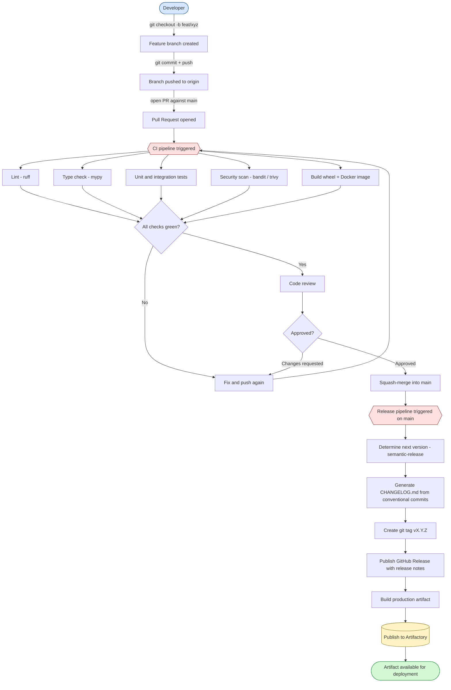
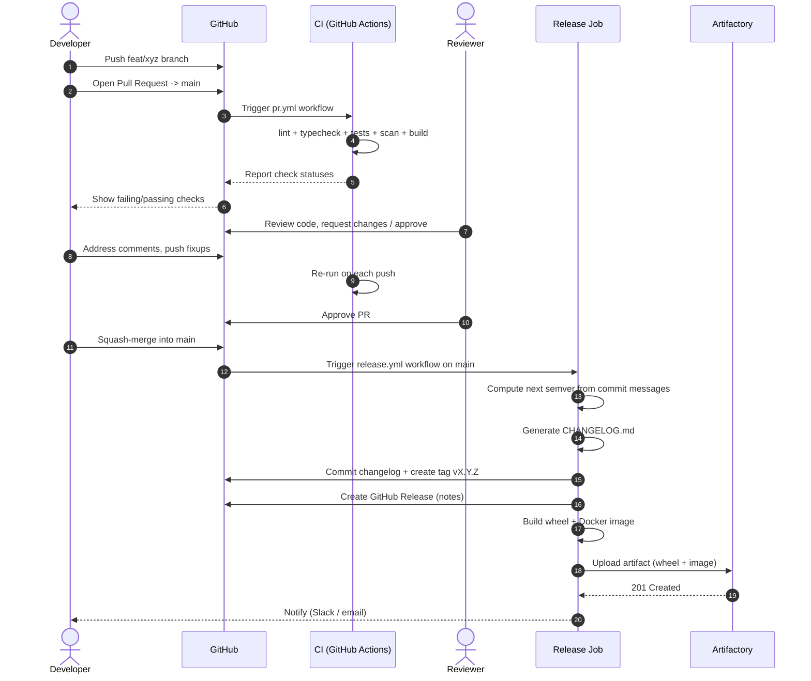
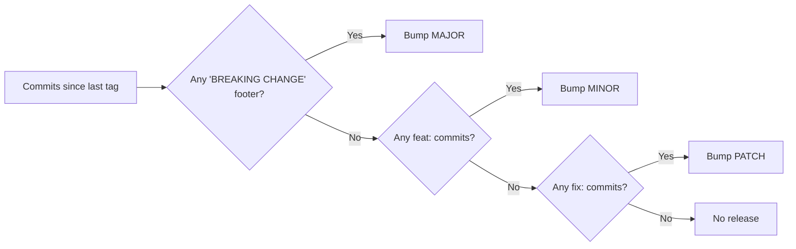
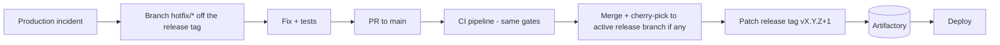

# Release Process

End-to-end flow from a feature branch to a published artifact in Artifactory.

## High-level flow



## Actors and responsibilities



## Branch and tag conventions

| Item | Convention | Example |
|---|---|---|
| Feature branch | `feat/<slug>` | `feat/user-profile` |
| Bugfix branch | `fix/<slug>` | `fix/login-timeout` |
| Hotfix branch | `hotfix/<slug>` | `hotfix/cve-2024-1234` |
| Commit format | Conventional Commits | `feat(api): add /users/me` |
| Release tag | `vMAJOR.MINOR.PATCH` | `v1.4.2` |
| Pre-release tag | `vX.Y.Z-rc.N` | `v1.4.2-rc.1` |

## Semver bump rules (driven by commit type)



## Pipeline gates

| Stage | Tool | Blocking | Notes |
|---|---|---|---|
| Lint | `ruff check` | yes | Style + common bugs |
| Format | `ruff format --check` | yes | Enforces single style |
| Types | `mypy --strict` | yes | Catches contract drift |
| Unit tests | `pytest tests/unit` | yes | Must run < 1 min |
| Integration | `pytest tests/integration` | yes | Postgres testcontainer |
| Coverage | `pytest --cov` | yes | Threshold = 80% |
| SAST | `bandit` | yes | Python security linter |
| Container scan | `trivy image` | yes | CVE gate on final image |
| Dependency audit | `pip-audit` | yes | Known vuln dependencies |
| Build | `uv build` + `docker build` | yes | Artifact must be reproducible |

## Artifactory layout

```
artifactory/
├── pypi-local/
│   └── fastapi-service/
│       ├── fastapi_service-1.4.2-py3-none-any.whl
│       └── fastapi_service-1.4.2.tar.gz
└── docker-local/
    └── fastapi-service/
        ├── 1.4.2
        ├── 1.4              # rolling minor tag
        └── latest           # only on stable main
```

## Hotfix path (compressed flow)


